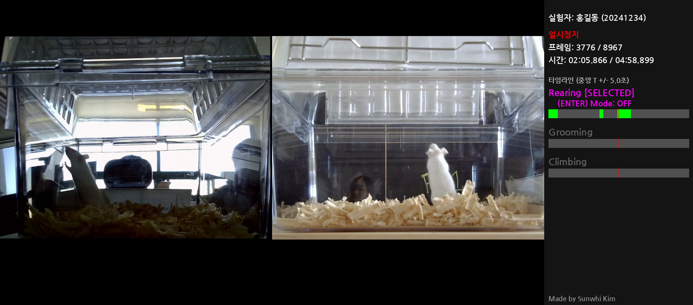
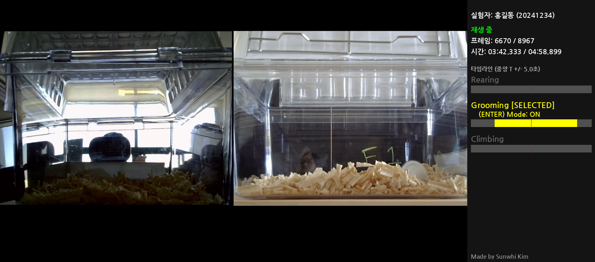
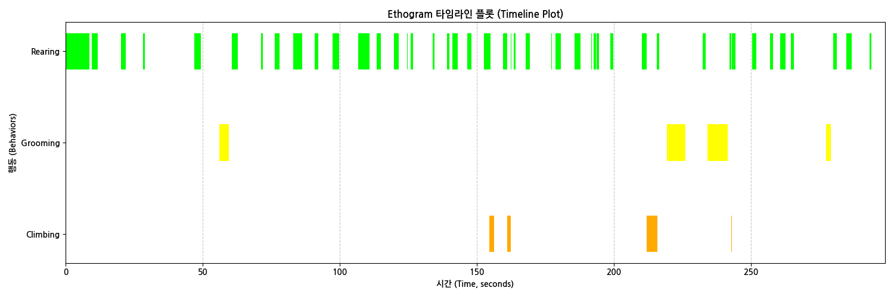
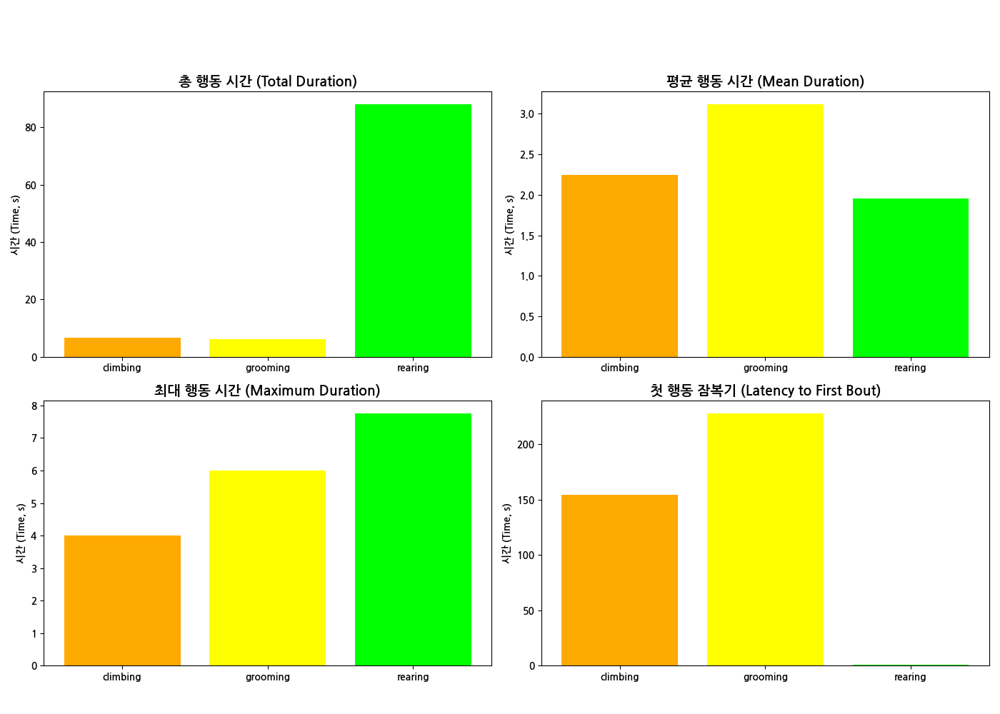

# Mouse Behavior Manual Scoring Tool

실험쥐 영상에서 행동(rearing, grooming, climbing)을 수동으로 스코어링하고, 결과를 시각화하는 도구입니다.

---

## 실행 화면

| 일시정지 상태 (Rearing 선택) | 재생 중 (Grooming 기록 중) |
|:---:|:---:|
|  |  |

## 출력 예시

**Ethogram 타임라인**


**행동 분포 요약 (Bar Chart)**


---

## 구성 파일

```
manscore/
├── scoring_tool.py        # 영상 재생 + 키보드로 행동 스코어링
├── analyze_scoring.py     # 스코어링 결과 CSV → 그래프(PNG) 생성
├── key_tester.py          # 키 입력 테스트 유틸리티
├── NanumGothic*.ttf       # 한글 폰트 (스크립트와 동일 폴더에 필요)
├── mouse_video.mp4        # 분석 대상 영상 (Git 미추적)
├── sample_data/
│   └── scoring_log_sample.csv   # 출력 형식 예시 (익명)
├── student_data/          # 실제 학생 결과물 (Git 미추적, 비공개)
└── docs/
    └── setup_notes.txt    # 환경 설정 참고 메모
```

---

## 사용 방법

### 1단계: 환경 설치

```bash
conda create -n manscore python=3.12
conda activate manscore
pip install opencv-python numpy Pillow pandas matplotlib
```

### 2단계: 스코어링 (`scoring_tool.py`)

```bash
python scoring_tool.py
```

- 실행 후 이름과 학번을 입력합니다.
- `mouse_video.mp4`가 **같은 폴더**에 있어야 합니다. → [📥 영상 다운로드 (Google Drive)](https://drive.google.com/file/d/1fPA_1c2SfhtffRs_SYR9D_5IbW6rOzA_/view?usp=sharing)
- 키보드 단축키:

| 키 | 기능 |
|---|---|
| `Space` | 재생 / 일시정지 |
| `↑` / `↓` | 행동 선택 (rearing / grooming / climbing) |
| `S` | 선택한 행동 START 기록 |
| `E` | 선택한 행동 END 기록 |
| `Q` | 종료 및 저장 |

- 결과는 `scoring_log_{학번}_{이름}.csv`로 저장됩니다.

### 3단계: 분석 및 시각화 (`analyze_scoring.py`)

```bash
python analyze_scoring.py
```

- 분석할 실험자 이름을 입력하면 해당 CSV를 자동으로 찾습니다.
- 두 종류의 그래프를 PNG로 저장합니다:
  - `plot_scoring_log_*.png` — Ethogram 타임라인
  - `bar_plots_scoring_log_*.png` — 행동별 요약 바 플롯

---

## 출력 CSV 형식

`sample_data/scoring_log_sample.csv` 참고.

```
# 실험자 이름: ...
# 실험자 학번/ID: ...
# 비디오 파일: mouse_video.mp4
# 총 프레임: 8967
# FPS: 30.000
# ------------------
Frame,Time (sec),Event,Behavior
33,1.100,START,rearing
266,8.867,END,rearing
...
```

---

## 분석 행동 종류

| 행동 | 색상 |
|---|---|
| `rearing` | 초록 |
| `grooming` | 노랑 |
| `climbing` | 주황 |

---

## 필요 패키지 요약

| 패키지 | 용도 |
|---|---|
| `opencv-python` | 영상 로드 및 화면 표시 |
| `numpy` | 프레임 배열 처리 |
| `Pillow` | 한글 폰트 렌더링 |
| `pandas` | CSV 파싱 및 통계 |
| `matplotlib` | 그래프 생성 |

> 자세한 설치 방법은 `docs/setup_notes.txt` 참고.

---

## 주의사항

- `mouse_video.mp4`는 용량 문제로 Git에서 추적하지 않습니다. [Google Drive 링크](https://drive.google.com/file/d/1fPA_1c2SfhtffRs_SYR9D_5IbW6rOzA_/view?usp=sharing)에서 다운로드 후 이 폴더에 넣어주세요.
- `student_data/` 폴더는 개인정보 보호를 위해 Git에서 제외됩니다.
